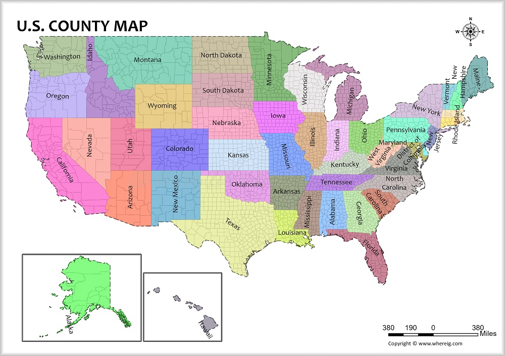

# 🇺🇸  Employment/Unemployment Data in the US since 1990

🟢 You can learn Data Engineering topics on your own time [here](https://github.com/DataTalksClub/data-engineering-zoomcamp) and follow along with the [video lectures](https://www.youtube.com/playlist?list=PL3MmuxUbc_hJed7dXYoJw8DoCuVHhGEQb) on YouTube!

# Problem Description
The objective of this project is to create a system that tracks historical US employment data (1990–Present) using datasets from the Bureau of Labor Statistics (BLS). The data provides granular insights down to the county level across the US, making it a valuable resource for individuals researching job market trends in specific regions—especially useful when considering relocation.

# Used Technologies
This project utilized the following tools and technologies:

Google Cloud Platform (GCP): Main cloud provider
Google Cloud Storage (GCS): Data lake storage
BigQuery: Data warehouse
Python: Main programming language
Docker: Containerization (via Docker Compose)
Apache Airflow: Workflow orchestration
Terraform: Infrastructure-as-Code (IaC)
Apache Spark: Data processing and transformation
Google Data Studio: Dashboard visualization

# Reproducing from scratch
#1. GCP Account Setup
Sign up for a free GCP account (includes $300 credit or 90 days of free usage).

Set up a service account:

Generate a JSON key file for the service account.
Save it to your local directory.
Install and configure Google Cloud CLI:

Download and install Google Cloud CLI.
Authenticate with GCP:
bash
export GOOGLE_APPLICATION_CREDENTIALS=<path/to/service/key>.json
gcloud auth application-default login

Assign permissions to the service account:

Navigate to IAM & Admin > IAM in the GCP console.
Add the following roles:
Storage Admin (for bucket management)
Storage Object Admin (for object-level operations)
BigQuery Admin (for data warehouse management)
Enable required APIs:

IAM API
IAM Credentials API
2. Infrastructure Setup with Terraform
Download and install Terraform.
Initialize your Terraform configuration:
Create a directory with a main.tf file for your configuration.
Run the following commands:
bash
Copy code
terraform init
terraform plan
terraform apply
Optionally, use a variables.tf file to store configuration variables.
3. Set Up Apache Airflow with Docker
Install Docker and Docker Compose.
Set up the necessary Dockerfile and docker-compose.yml files to run Airflow.
Follow the Apache Airflow installation guide for configuration steps.
4. Run Data Pipelines
Use the Airflow web interface to execute the following DAGs:
data_ingestion_gcp_dag: Ingests data into GCS. Run this first and wait for it to complete.
gcs_to_bq_dag: Loads data from GCS into BigQuery.
Monitor the task progress for both DAGs to ensure successful execution.
5. Create a Dashboard in Google Data Studio
Open Google Data Studio.
Create a new data source:
Select BigQuery as the source.
Connect to your project, dataset, and table.
Use the imported data to create interactive visualizations.
To optimize performance, uncheck blank values in dropdowns for "State" and "Year."
Project Outcomes
This project provides a robust system to analyze historical employment data at a granular level, enabling users to make informed decisions about the job market. Below is a snapshot of the dashboard showcasing key metrics and trends.

Contact and Feedback
For questions, feel free to:

Open a pull request (PR) on this repository.
Send an email.
Thank you for your support and interest in this project! 🚀
